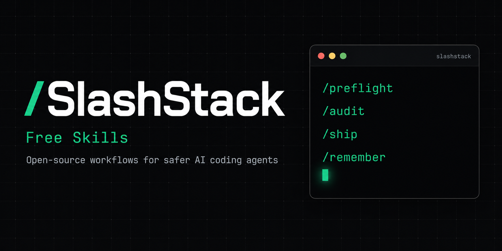

<div align="center">

<!-- HERO BANNER -->


<br />

# ⚡ SlashStack Free Skills

### Eleven open-source workflows that make AI coding agents **inspect before editing, verify before stopping, and remember what matters**

<p>
  <a href="LICENSE"></a>
  <a href="https://github.com/mverab/slashstack-skills/stargazers"></a>
  <a href="https://github.com/mverab/slashstack-skills/network/members"></a>
  <a href="https://github.com/mverab/slashstack-skills/issues"></a>
  <a href="https://www.npmjs.com/package/slashstack"></a>
</p>

<p>
  <a href="https://slashstack.dev"></a>
  <a href="https://slashstack.dev/#pricing"></a>
</p>

<br />

> **⭐ If these skills make your agent safer, a star helps other developers find them.**
> It takes one click and keeps this free layer maintained.

<br />

[**🌐 Website**](https://slashstack.dev) • [**📦 npm installer**](https://www.npmjs.com/package/slashstack) • [**🐛 Issues**](https://github.com/mverab/slashstack-skills/issues) • [**⚡ Pro tier**](https://slashstack.dev/#pricing)

---

</div>

## ✨ What is SlashStack?

**SlashStack Free Skills** is a set of **agent skills for AI coding assistants** — plain Markdown workflows that tools like **Claude Code**, **Codex**, **Cursor**, **Hermes**, and other repo-aware agents read and follow. They give your agent **guardrails**: it inspects the repo before touching code, verifies with real evidence before claiming done, and preserves durable project context across sessions.

These eleven skills are the **MIT-licensed free layer** of [SlashStack](https://slashstack.dev) — a repo-local agent operating layer. No runtime, no accounts, no lock-in. Just readable, editable, versionable Markdown.

- ✅ **Zero dependencies** — plain Markdown, works with any skill-aware agent
- ✅ **Local-first** — lives in your repo, versioned with your code
- ✅ **Battle-tested workflows** — planning, preflight, audit, ship, memory
- ✅ **Free forever** — MIT licensed, commercial use welcome
- ✅ **Upgrade path** — [Pro](https://slashstack.dev/#pricing) adds 8 more skills + 6 always-on guards

---

## 🚀 Quick Start

### Option A — Recommended installer (adds kernel + memory structure)

```bash
# Portable default — skills land in .agents/skills/
npx slashstack@latest install --target agents

# Claude Code — skills land in .claude/skills/
npx slashstack@latest install --target claude
```

### Option B — Copy only the skill files

```bash
git clone https://github.com/mverab/slashstack-skills.git
mkdir -p your-project/.agents/skills
cp -R slashstack-skills/skills/* your-project/.agents/skills/
```

### Use them

In your agent session, invoke any skill by name:

```
/preflight   → before editing code
/audit       → before committing
/ship        → before handoff
/remember    → after a useful session
```

---

## 🧰 The Eleven Free Skills

| Skill | What it does | When to use it |
|-------|--------------|----------------|
| **`/preflight`** | Inspects repo state, conventions, and constraints; flags risks with severity | Before editing any code |
| **`/vibe`** | Turns rough intent into a focused, scoped build direction | When the idea is still fuzzy |
| **`/audit`** | Reviews changes for bugs, regressions, missing tests, and release risk | Before committing or opening a PR |
| **`/ship`** | Runs final verification and produces an evidence-backed go/no-go | Before handoff or deploy |
| **`/execute`** | Turns a multi-step task into a scoped goal with acceptance criteria | For work spanning multiple files |
| **`/security`** | Beginner-friendly pre-deploy review: secrets, auth, public routes | Before deploying or sharing |
| **`/remember`** | Saves durable project facts future sessions will need | After a productive session |
| **`/recall`** | Loads saved subsystem context, validated against the current code | Before working in a known area |
| **`/improve`** | Captures reusable workflow patterns from completed work | When you discover a better way |
| **`/explain`** | Translates technical agent output into plain language | When onboarding non-experts |
| **`/next`** | Suggests 2–3 safe next prompts without editing anything | When you don't know what to ask |

---

## 🆚 Free vs Pro

This repository intentionally contains **only** the eleven free skills.

[**SlashStack Pro**](https://slashstack.dev/#pricing) — one-time purchase, lifetime updates — adds:

| | Free (this repo) | **Pro** |
|---|:---:|:---:|
| Workflow skills | 11 | **19** |
| Always-on guards (commit/push/install/env) | — | **6** |
| Senior Mode (smallest-surface planning) | — | ✅ |
| Git `pre-commit` + `pre-push` secret scanning | — | ✅ |
| Checkpoint recovery (clean Git snapshots) | — | ✅ |
| Offline license validation | — | ✅ |

> The Pro layer is **not** published in this repository. This repo stays 100% MIT — no bait-and-switch.

---

## 🤝 Contributing

Contributions are welcome — this is an open project with a private upstream, and community input shapes the free layer.

- **Bug reports & skill improvements** → [open an issue](https://github.com/mverab/slashstack-skills/issues)
- **Pull requests** → see [CONTRIBUTING.md](CONTRIBUTING.md)
- **New skill ideas** → propose them in an issue first (the free layer stays deliberately focused)

See [CONTRIBUTING.md](CONTRIBUTING.md) for the full guide.

## ⭐ Show your support

If SlashStack skills saved you from a bad commit, a hallucinated refactor, or a lost context window:

- **Star this repo** — it tells other developers this is worth their time
- **Share it** — [slashstack.dev](https://slashstack.dev)
- **Upgrade to [Pro](https://slashstack.dev/#pricing)** — supports continued maintenance of the free layer

---

## 🔌 Compatibility

SlashStack skills are agent-readable Markdown with YAML frontmatter — no runtime dependency. Tested with **Claude Code**, **Codex**, **Cursor**, and **Hermes Agent**. Any agent that reads `AGENTS.md`-style contracts and skill files can use them.

## 📄 License

MIT — free for commercial and personal use, forever. See [LICENSE](LICENSE).

---

<div align="center">

<sub>Built by <a href="https://github.com/mverab">@mverab</a> · Part of the <a href="https://slashstack.dev">SlashStack</a> agent operating layer</sub>

</div>
